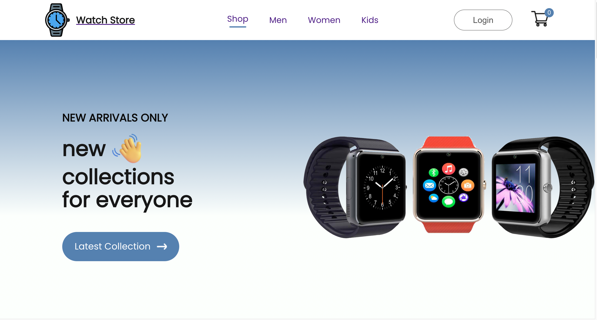
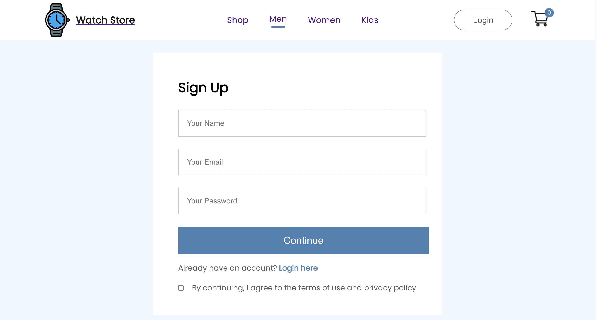
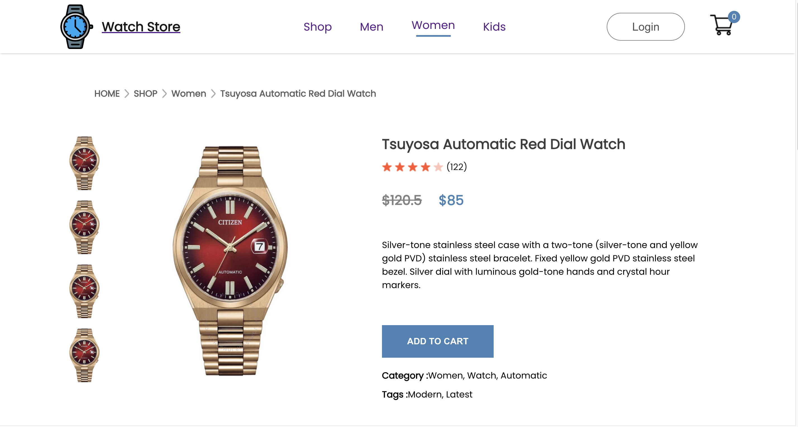
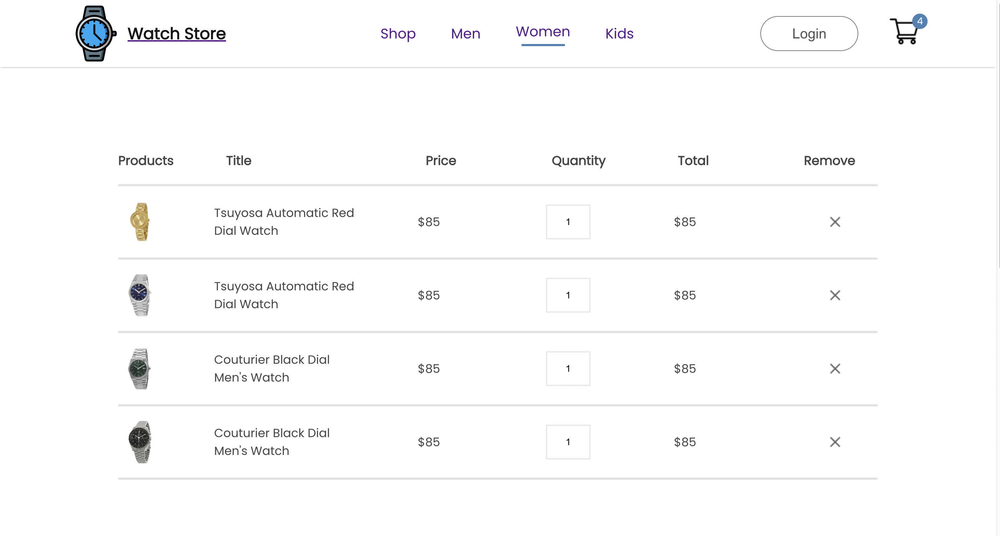

# Watch Store E-commerce Website

Watch Store E-commerce website built using React. This project provides a seamless online shopping experience for users interested in purchasing watches. Below is an overview of the key components and features implemented in the application.

## Table of Contents

- [Watch Store E-commerce Website](#watch-store-e-commerce-website)
  - [Table of Contents](#table-of-contents)
  - [Home page](#home-page)
  - [Login Page](#login-page)
  - [Categories Page](#categories-page)
  - [Product Details Page](#product-details-page)
  - [Cart Page](#cart-page)
  - [Installation](#installation)
  - [Usage](#usage)
  - [License](#license)

## Home page

- **Header:** Navigation links and options for easy exploration.
- **Popular Products:** Featured trending and best-selling watches.
- **Exclusive Offers:** Special discounts on premium watches.
- **New Collections:** Latest and stylish watch collections.
- **Newsletter Section:** Subscription for updates on arrivals and promotions.
- **Footer:** Important links, contact details, and additional information.

## Login Page

Secure login for user account access.

## Categories Page

Organized product categories for user-friendly browsing.

## Product Details Page

- **Pictures:** Detailed images for a clear view.
- **Rating:** User reviews and ratings.
- **Promotion:** Display of promotional and original prices.
- **Description and Reviews:** In-depth product information and customer reviews.
- **Category and Tags:** Categorization and tags for easy navigation.
- **Related Products:** Showcase of related items.

## Cart Page

- **Products Added to Cart:** Overview with customization options.
- **Price for Each Product:** Individual and discounted prices.
- **Quantity and Total Price:** Quantity details and total price.
- **Total Price:** Cumulative total of items in the cart.
- **Promo Code Option:** Space for applying promo codes.
- **Shipping Fee:** Transparent display of shipping fees.

## Installation

1. Clone: `git clone https://github.com/your-username/watch-store.git`
2. Navigate: `cd watch-store`
3. Install: `npm install`

You can find the Assets folder following this link [Click here](https://drive.google.com/file/d/1Aw9vjwgnM77KdMn6Pi4bIYpg7PqZzODC/view?usp=sharing)

## Usage

Run: `npm start`
Visit [http://localhost:3000](http://localhost:3000) in your browser.

## License

This project is under the [MIT License](LICENSE). Use and modify as per the license terms.
